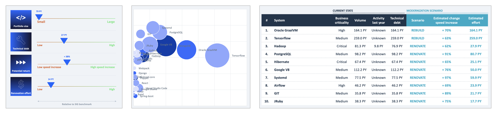

# Sigrid Report Generator

The Sigrid Report Generator is a tool/framework designed to generate any kind of report that is based on data
provided by Sigrid. The Report Generator can be used for two "flavors" of report:

- Standard reports provided by SIG.
- Your own custom reports, which use your own Word/PowerPoint templates.


## Prerequisites

- Python 3.9+
- You need to be able to install and use Python packages
- You need a [Sigrid API token](https://docs.sigrid-says.com/organization-integration/authentication-tokens.html)

## Install using pip

1. Clone this repository and `cd` into it.
2. Install the tool itself: `pip3 install -e ./report-generator"`.
    - If this fails with an error message that says something like "error: can't create or remove files in install
      directory", try adding `--user` to the above command.
    - If this fails with an error message saying something like "error: externally-managed-environment", try installing
      in a `venv` (Virtual environment). If you don't know how that works, ask for help.

Alternatively, you can use the docker image: `softwareimprovementgroup/sigrid-integrations`

## Usage

1. For the default report, use: `report-generator -c <your-customer> -s <your-system> -t <your-sigrid-token>`
2. If you want to provide your own custom report `.pptx` or `.docx` file. Use:
   `report-generator -p <your-file.pptx> -c <your-customer> -s <your-system> -t <your-sigrid-token>`
3. For help or an overview of all options use `report-generator --help`

If all goes well, the report should be generated into `out.pptx`/`out.docx` in the folder where you run the command, or
wherever you specify with the `-o` option.

### Generating standard reports

**ITDD report:** Lightweight report that provides general information on a system, suitable for an ITDD setting.
  - Example: `report-generator -c <your-customer> -s <your-system> --layout default`


**Objectives report:** Reports on progress towards your [Sigrid objectives](https://docs.sigrid-says.com/capabilities/portfolio-objectives.html).
Includes both the overall trend and a breakdown per team.
  - Example: `report-generator -c <your-customer> --layout objectives`
  - Optionally, you can use the `--start` argument to configure the reporting period.


**Modernization report:** Analyses all systems across your portfolio, and provides information on how to prioritize
modernization initiatives based on factors such as estimated development speed increase and estimated effort.
The [Sigrid documentation](https://docs.sigrid-says.com/capabilities/reports/modernization-report.html) contains
more information.
  - Example: `report-generator -c <your-customer> --layout modernization`



**System maintainability one-pager:** Simple report that focus on a system's maintainability system, both in terms
of its current state and its progress over time.
  - Example: `report-generator -c <your-customer> -s <your-system> --layout system-maintainability-one-pager`
  - The default reporting period is one month. If you want to change the reporting period, you can use the
    argument `--start 2025-03-01`.


### Troubleshooting

If there is an error and you can't figure out what causes it, run the tool again with the `-d` parameter appended to
gather additional information. If you find a bug, please create a ticket in this project.

Use `report-generator --help` for an overview of configuration options.

## Create your own template

Report generator is flexible. It allows you to input your own `.pptx` or `.docx` template, and it will populate it with
data from Sigrid. You can define your template from scratch, or modify an existing template. You can find the built-in
templates in the `src/report_generator/templates` folder of the report-generator repository. Once you have created your
template, you can insert it into the reourt generator by using the `-p`/`--template` command line argument.

There are roughly two types of items in a template that report-generator deals with:

- **Textual data**: Data such as numbers and text can be freely placed wherever you want it. In a table, in a paragraph,
  in a slide title. This works with placeholders. For example, if you write `MAINT_RATING` in your template, the tool
  will replace that with the actual maintainability rating. A large number of metrics/texts is supported. For a full
  overview, see [docs/placeholder descriptions.md](docs/placeholder%20descriptions.md)
- **Charts**: These are not yet very flexible. You can change the look and feel of the charts define in the existing
  templates, but you cannot change their structure. If you think a chart with a different structure is clearly needed,
  or better than the current visualization, reach out to the report-generator team. At the time of writing, only several
  PowerPoint charts are supported.

## Create custom placeholders

> For instructions specific to developers, see [docs/developers.md](docs/developers.md)

To use custom placeholders in your own templates outside of this project:

1. Import the `report_generator` module in your separate project.
2. Define placeholders by extending the `Placeholder` class or using helper functions.
3. Interact with the ReportGenerator class to register the placeholders and generate the report.

Note: These instructions are for creating extensions in your own projects. For extending this project itself, please
refer to the developer documentation in [docs/developers.md](docs/developers.md).

If you introduce new placeholders, you will need to regenerate the documentation. To do this, make sure you first
[install the Report Generator](#install-using-pip). After that, run `./generate_placeholder_docs.py`, then commit
the results.

### Examples

#### Simple text placeholder of current week number

```python
from datetime import datetime

import report_generator

# Custom template
generator = report_generator.ReportGenerator(template_path="location_of_template.pptx")


# Custom placeholder
@report_generator.placeholders.text_placeholder()
def week_number():
    return datetime.now().isocalendar()[1]
```

#### Parameterized text placeholder

```python
from report_generator.placeholders import parameterized_text_placeholder


# Custom parameterized placeholder (e.g. LIST_VALUE_1, LIST_VALUE_2, ..., LIST_VALUE_5)
@parameterized_text_placeholder(custom_key="LIST_VALUE_{parameter}",
                                parameters=range(1, 6))
def list_value_for_idx(idx: int):
    return some_value(idx)
```

#### Completely custom placeholder

```python
from pptx.chart.data import CategoryChartData

from report_generator.placeholders import Placeholder
from report_generator import report_utils


class ComplexChartPlaceholder(Placeholder):
    key = "COMPLEX_CHART"

    @classmethod
    def value(cls, parameter=None):
        return {"labels": ["A", "B", "C"], "axisLabel": "X", "series": [1, 2, 3]}

    @staticmethod
    def resolve_pptx(presentation, key: str, value_cb) -> None:
        charts = [
            shape.chart
            for slide in report_utils.pptx.identify_specific_slide(presentation, key)
            for shape in slide.shapes
            if shape.has_chart
        ]

        if len(charts) == 0:
            return

        values = value_cb()
        chart_data = CategoryChartData()
        chart_data.categories = values["labels"]
        [chart_data.add_series(values["axisLabel"], y) for y in values["series"]]
```

#### Registering custom placeholders and generating the report

```python
generator.register_additional_placeholders({
    week_number,
    list_value_for_idx,
    ComplexChartPlaceholder
})

generator.generate("out.pptx")
```

## Contact and support

Feel free to contact SIG’s [support department](mailto:support@softwareimprovementgroup.com) for any questions or
issues you may have after reading this document, or when using Sigrid or Sigrid CI. Users in Europe can also
contact us by phone at +31 20 314 0953.

## License

Copyright Software Improvement Group

    Licensed under the Apache License, Version 2.0 (the "License");
    you may not use this file except in compliance with the License.
    You may obtain a copy of the License at

        http://www.apache.org/licenses/LICENSE-2.0

    Unless required by applicable law or agreed to in writing, software
    distributed under the License is distributed on an "AS IS" BASIS,
    WITHOUT WARRANTIES OR CONDITIONS OF ANY KIND, either express or implied.
    See the License for the specific language governing permissions and
    limitations under the License.
