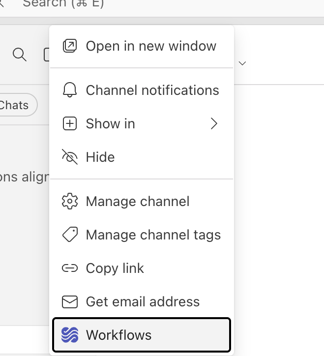
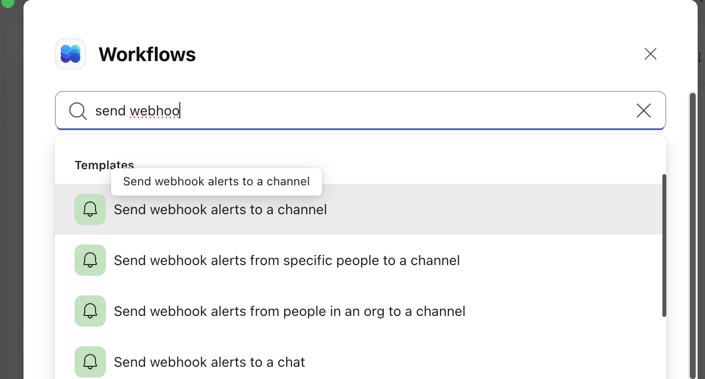
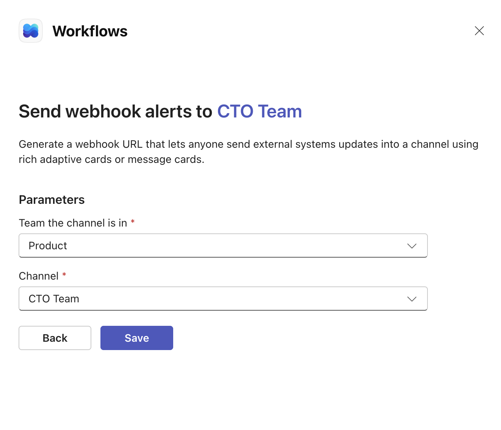
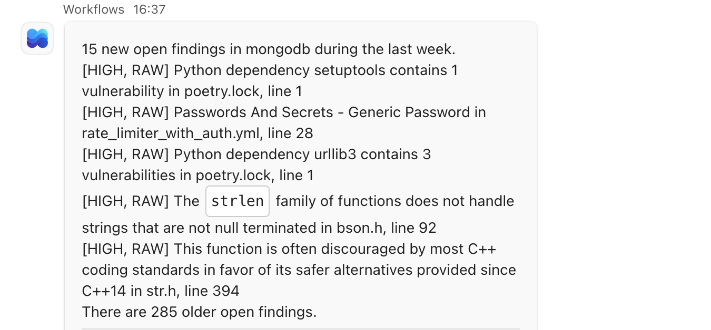

## Usage

The idea is to use this script for instance once per day as a scheduled job, the same as the Slack version.

### Prerequisites

- You need a [Sigrid authentication token](https://docs.sigrid-says.com/organization-integration/authentication-tokens.html).
- You need to create a Teams webhook (see below).

### Step 1: Create a webhook in Microsoft Teams

> Note: Microsoft has deprecated the old "Incoming Webhook" connector. Use the **Workflows app** instead.

1. In Teams, go to the channel where you want alerts posted.
2. Click **"..." (more options)** next to the channel name.
3. Select **Workflows**.

  

4. Search for and select the template **"Send webhook alerts to a channel"**.

   

5. Confirm the team and channel, then **Save**.

   
  
6. Copy the generated webhook URL.


### Step 2: Store secrets in your CI/CD environment

Store both as secrets:
- `SIGRID_CI_TOKEN`: your Sigrid authentication token
- `TEAMS_WEBHOOK`: the webhook URL from Step 1

### Step 3: Add a scheduled job (GitHub Actions example)

```yaml
name: "Teams alerts for Sigrid security findings"
on:
  schedule:
    - cron: "0 6 * * 1-5"
jobs:
  teamsalerts:
    name: "Send Teams alerts"
    runs-on: ubuntu-latest
    steps:
      - name: "Check out repository"
        uses: actions/checkout@v4
      - name: Download Sigrid integrations
        run: "git clone https://github.com/Software-Improvement-Group/sigrid-integrations.git sigrid-integrations"
      - run: "sigrid-integrations/teams-security-findings/daily_findings.py --customer mycustomer --system mysystem"
        env:
          SIGRID_CI_TOKEN: "${{ secrets.SIGRID_CI_TOKEN }}"
          TEAMS_WEBHOOK: "${{ secrets.TEAMS_WEBHOOK }}"
```

Replace `mycustomer` and `mysystem` with your Sigrid customer account name and system name.

### Example result


